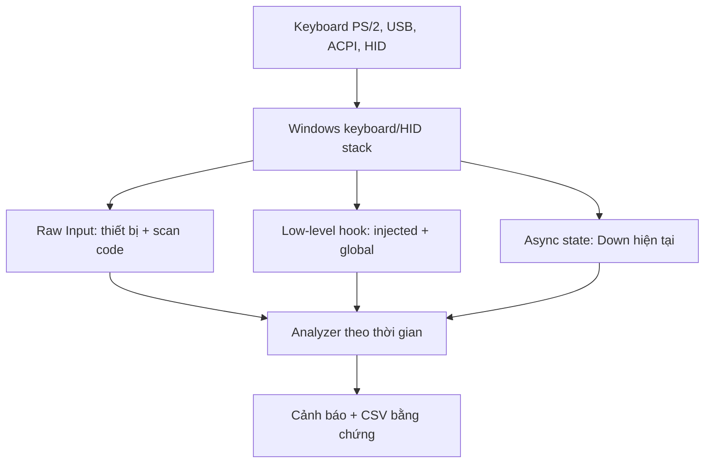

# Nghiên cứu kỹ thuật — kiểm tra bàn phím laptop trên Windows đến 2026

Ngày nghiên cứu: 05/09/2026 (UTC)  
Phạm vi: ứng dụng chẩn đoán bàn phím laptop Windows; không thay thế phép đo điện tại socket keyboard/EC/KBC.

Bản phát hành 0.3.0 do **MÁY TÍNH HÀ ANH**, xã Như Thanh, tỉnh Thanh Hoá phát hành theo giấy phép MIT. Icon, manifest và metadata được nhúng trực tiếp; thư mục `dist` bị kiểm tra để chỉ chứa một EXE portable dùng trên USB.

## 1. Vấn đề của công cụ trình duyệt

Ba trang được đối chiếu:

- [Key-Test](https://en.key-test.ru/) mô tả mô hình cơ bản: phím đang giữ và phím đã nhả; Fn được thử thông qua tổ hợp âm lượng.
- [KICAP Keyboard Tester](https://kicap.vn/test-ban-phim) công bố kiểm tra double click, loạn, kẹt và ghosting nhưng vẫn chạy “ngay trên trình duyệt”.
- [KeyTest.vn](https://keytest.vn/) là công cụ test web cùng nhóm sử dụng.

Trình duyệt chủ yếu cung cấp sự kiện DOM sau khi Windows và browser đã diễn giải đầu vào. Các giới hạn thực tế:

- tab phải giữ focus; shortcut của hệ điều hành/browser có thể bị xử lý trước;
- DOM không cung cấp handle thiết bị, vì vậy khó phân biệt bàn phím laptop với USB/Bluetooth;
- media/Fn/assistant có thể đi qua Consumer Control, ACPI hoặc firmware thay vì `keydown` thông thường;
- test nhấn từng phím không kích hoạt một số lỗi chạm ma trận chỉ xuất hiện khi giữ tổ hợp;
- một phím tự phát xung rất ngắn hoặc lỗi KeyUp cần timeline/đối chiếu trạng thái, không chỉ tô màu keycap;
- sự kiện do macro/phần mềm chèn dễ bị hiểu nhầm là phần cứng nếu không kiểm tra cờ injected.

Vì thế, “trang web test thấy phím cơ bản OK” chỉ chứng minh đường nhập cơ bản hoạt động trong phiên đó; chưa loại trừ chạm chập chờn, ghost key theo tổ hợp, lỗi phụ thuộc nhiệt/áp lực, hoặc firmware xử lý riêng.

## 2. Cơ sở API Windows

Microsoft mô tả Raw Input là đường nhận ổn định cho HID; nó giữ dữ liệu thấp hơn mô hình message truyền thống, nhận scan code, có thể phân biệt nguồn của hai thiết bị cùng loại, và nhận ở nền khi đăng ký `RIDEV_INPUTSINK`: [Raw Input Overview](https://learn.microsoft.com/en-us/windows/win32/inputdev/about-raw-input).

Ứng dụng phải gọi `RegisterRawInputDevices` trước khi nhận `WM_INPUT`; cờ `RIDEV_DEVNOTIFY` cho phép theo dõi cắm/rút thiết bị: [RegisterRawInputDevices](https://learn.microsoft.com/en-us/windows/win32/api/winuser/nf-winuser-registerrawinputdevices).

`RAWKEYBOARD.Flags` phân biệt Make/Break và tiền tố E0/E1, giúp tách Down/Up và phím mở rộng: [RAWKEYBOARD](https://learn.microsoft.com/en-us/windows/win32/api/winuser/ns-winuser-rawkeyboard).

Hook `WH_KEYBOARD_LL` có thể thấy sự kiện toàn hệ thống và `KBDLLHOOKSTRUCT` có cờ `LLKHF_INJECTED`: [KBDLLHOOKSTRUCT](https://learn.microsoft.com/en-us/windows/win32/api/winuser/ns-winuser-kbdllhookstruct). Microsoft cảnh báo hook phải trả nhanh và trong đa số trường hợp nên ưu tiên Raw Input; do đó bản thiết kế dùng Raw Input làm bằng chứng phần cứng chính, hook chỉ làm lớp đối chiếu và callback luôn chuyển tiếp bằng `CallNextHookEx`: [LowLevelKeyboardProc](https://learn.microsoft.com/en-us/previous-versions/windows/desktop/legacy/ms644985(v=vs.85)).

`GetAsyncKeyState` cung cấp trạng thái hiện thời qua bit cao; bit “đã nhấn gần đây” không đáng tin trong môi trường đa nhiệm, vì vậy ứng dụng chỉ dùng bit Down: [GetAsyncKeyState](https://learn.microsoft.com/en-us/windows/win32/api/winuser/nf-winuser-getasynckeystate).

USB-IF phát hành HID Usage Tables 1.7 ngày 27/01/2026. Thiết kế đăng ký cả keyboard TLC (Usage Page 0x01, Usage 0x06) và Consumer Control (Usage Page 0x0C, Usage 0x01), lưu raw report chưa ánh xạ để không bỏ hoàn toàn phím media/assistant mới: [HID Usage Tables 1.7](https://usb.org/document-library/hid-usage-tables-17).

`RAWMOUSE` cung cấp cờ chuyển trạng thái riêng cho nút trái/phải/giữa, bánh xe dọc/ngang và độ dịch chuyển X/Y. Bản 0.2 đăng ký Generic Desktop Mouse (Usage Page 0x01, Usage 0x02) và dùng đúng các cờ này để đo touchpad/clickpad: [RAWMOUSE](https://learn.microsoft.com/en-us/windows/win32/api/winuser/ns-winuser-rawmouse).

Windows cho phép đọc repeat delay và repeat speed hiện hành bằng `SPI_GETKEYBOARDDELAY` và `SPI_GETKEYBOARDSPEED`. Delay nằm khoảng 250–1000 ms; tốc độ khoảng 2,5–30 lần/giây và có thể lệch theo phần cứng. Vì thế `REPEAT_STORM` phải tính từ cấu hình máy thay vì dùng số cố định: [SystemParametersInfo](https://learn.microsoft.com/en-us/windows/win32/api/winuser/nf-winuser-systemparametersinfoa).

Nghiên cứu keystroke dynamics thường phân tích hai đặc trưng chính là dwell time và flight time; khảo sát tổng hợp 187 công trình xác nhận đây là hai nhóm đặc trưng được dùng phổ biến: [Teh và cộng sự, 2013](https://pmc.ncbi.nlm.nih.gov/articles/PMC3835878/). Một nghiên cứu năm 2025 ghi nhận median dwell của các nhóm người tham gia thường nằm trong khoảng 60–130 ms, nhưng khác biệt giữa người và bàn phím đủ lớn để không nên dùng khoảng này làm tiêu chuẩn tuyệt đối: [Martins và cộng sự, 2025](https://link.springer.com/article/10.1007/s42452-025-07449-5). Do đó ứng dụng dùng ngưỡng bảo thủ cho xung cực ngắn và mô hình median/MAD tự học theo từng phiên.

## 3. Kiến trúc được chọn

Nguyên tắc:

- Raw Keyboard là nguồn chính để kết luận lỗi phần cứng.
- Hook không được dùng để chặn; chỉ nhận diện injected và đối chiếu.
- Poll 20 ms không thay Raw Input; nó phát hiện sai lệch trạng thái hoặc KeyUp bị mất.
- Raw HID Consumer được lưu hex vì report descriptor phụ thuộc thiết bị; giải mã sai còn nguy hiểm hơn lưu bằng chứng thô.
- Thiết bị được chọn bằng đúng raw device path để tránh bàn phím USB làm nhiễu test laptop.
- Thuật toán dùng đồng hồ đơn điệu cho khoảng thời gian; giờ hệ thống chỉ dùng hiển thị/báo cáo.
- Khi test bàn phím, `ProcessCmdKey` chỉ tiêu thụ lệnh điều hướng mũi tên của chính giao diện; Raw Input vẫn ghi Down/Up và hook không chặn phím toàn hệ thống.
- Raw Mouse đo touchpad, click trái/phải, cuộn và device path. Precision Touchpad có thể bị Windows hợp nhất thành `SYSTEM`, nên không cam kết tách được touchpad và chuột USB trên mọi model.

## 4. Logic phát hiện

### Chatter

Nếu một chu kỳ `Down → Up → Down` mới có khoảng `Up → Down` nhỏ hơn ngưỡng (mặc định 45 ms), ghi `CHATTER`. Đây là “nghi lỗi”, vì người dùng rất nhanh vẫn có thể double-tap chủ ý.

### Stuck và repeat storm

- Raw state còn Down quá 2500 ms: `STUCK_KEY`.
- Nhiều raw Down lặp khi state chưa Up: coi là typematic. Ngưỡng `REPEAT_STORM` được tính bằng tốc độ Windows × 1,4 cộng biên an toàn.
- Repeat đầu tiên đến sớm hơn repeat delay của Windows trừ biên 80 ms: `EARLY_REPEAT`.
- Hai bằng chứng đi cùng nhau mạnh hơn từng bằng chứng đơn lẻ.

### Mất KeyUp / trạng thái không khớp

- Poll đã Up nhưng state Raw vẫn Down quá cửa sổ 180 ms: `RAW_MISSING_KEYUP`.
- Poll Down nhưng không có raw event gần đó: `POLL_ONLY_DOWN`.
- Modifier generic VK_SHIFT/VK_CONTROL/VK_MENU không được poll để tránh cảnh báo trùng với mã Left/Right đã chuẩn hóa.

### Tự chạm

Sau grace period 1200 ms của phiên 30 giây, bất kỳ raw Down nào từ thiết bị đã chọn đều tạo `IDLE_CONTACT`. Gói Consumer HID tạo `IDLE_HID_CONTACT`.

### Chạm ma trận

Trong mỗi bước, người dùng chỉ giữ cặp phím đã chỉ định. Nếu raw Down xuất hiện với VK khác hai phím đó, tạo `PHANTOM_KEY`. Phải lặp lại tối thiểu ba lần trước khi kết luận.

### Mô hình hành vi/tốc độ bấm của người

- **Dwell time**: thời gian từ Down đến Up của cùng phím.
- **Xung cực ngắn**: dưới 12 ms mặc định không kết luận ngay; từ hai xung cùng phím trong 1500 ms tạo `NON_HUMAN_PULSE`.
- **Học thích nghi**: lấy tối đa 500 dwell hợp lệ, dùng median và MAD; chỉ bắt đầu cảnh báo lệch cá nhân sau 20 mẫu. Ba outlier cùng phím trong 3 giây tạo `HUMAN_TIMING_OUTLIER`.
- **Nhịp gần như máy**: bảy lần Down tạo sáu chu kỳ; nếu chu kỳ 20–500 ms nhưng độ lệch chuẩn không quá 2 ms, tạo `MACHINE_RHYTHM`.
- **Burst nhiều phím**: ít nhất bốn phím khác nhau trong 8 ms tạo `NON_HUMAN_BURST`; đây là cảnh báo nghi chạm ma trận hoặc tì cả cụm, không tự động kết luận hỏng.
- **Typematic theo máy**: đọc delay/rate từ Windows để không nhầm việc giữ phím bình thường với phím tự chạm.

Mô hình không “giả làm người” bằng cách phát phím vào Windows. Nó mô phỏng miền thời gian hợp lý của thao tác người và so bằng chứng thật với miền đó; cách này an toàn hơn vì không làm nhiễu phiên đo.

### Touchpad và nút trái/phải

- Raw movement xác nhận vùng rê hoạt động; thống kê số event và tổng quãng dịch chuyển tương đối.
- Cờ Left/Right/Middle Down/Up cập nhật sơ đồ clickpad theo thời gian thực.
- Up→Down quá sát tạo `TOUCHPAD_CHATTER`; Down quá ngưỡng tạo `TOUCHPAD_STUCK`.
- Khi gắn chuột ngoài, kỹ thuật viên chọn đúng raw device path hoặc tháo chuột USB để tránh trộn nguồn.

## 5. Hướng phát triển sau MVP

- Giải mã HID report descriptor bằng `HidP_GetUsages` để đặt tên chính xác Consumer Usage theo từng thiết bị.
- Hồ sơ layout riêng cho các dòng Dell/HP/Lenovo/Asus/Acer/MSI và các phím Copilot/assistant.
- Test ma trận 3 phím/NKRO sinh tự động theo layout thực tế và lưu heatmap cặp gây lỗi.
- Chế độ burn-in 1–8 giờ, thống kê lỗi theo nhiệt độ, nguồn AC/battery và thao tác palmrest.
- Chữ ký số EXE/MSIX và bộ cài; hiện bản MVP build offline từ source để người sửa chữa kiểm tra được toàn bộ hành vi.
